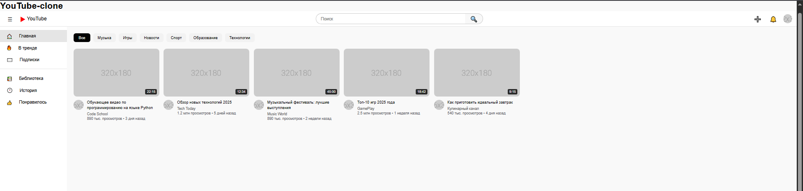
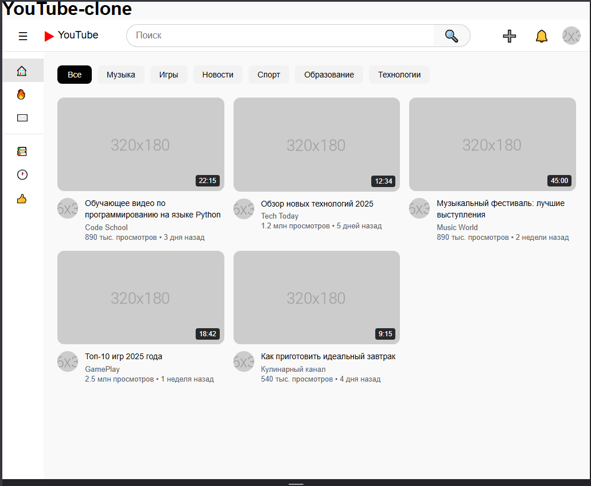
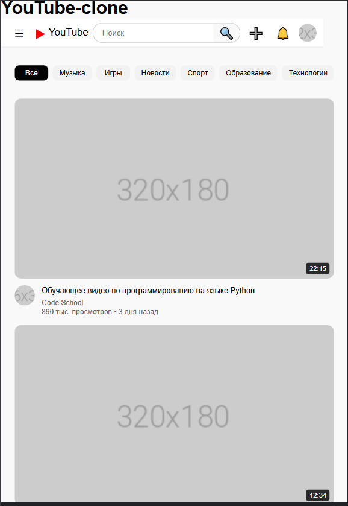

# YouTube Clone - Лабораторная работа №10-11
**Студент:** Лепилкин Максим Алексанлрович
**Группа:** ИСП-232

---

## Описание
Этот проект представляет собой адаптивный клон главной страницы YouTube, созданный в ходе лабораторных работ №10 и №11. Основная цель — изучение и применение современных техник вёрстки: Flexbox для построения гибких макетов (шапка, боковая панель) и CSS Grid для создания сложных, адаптивных сеток (сетка с видео).

---

## Реализованные функции
- [x] **Адаптивный хедер с поиском:** Шапка сайта, состоящая из трёх блоков (логотип, поиск, иконки), выровнена с помощью Flexbox. Строка поиска стилизована как единый элемент с кнопкой.
- [x] **Боковая панель навигации:** Фиксированной ширины панель с вертикальным меню, иконками-эмодзи, разделителем и выделением активного пункта («Главная»).
- [x] **Категории (чипсы) с интерактивностью:** Горизонтальный блок с прокруткой, содержащий кнопки категорий, оформленные в виде «чипсов». Реализованы стили для обычного состояния, при наведении и для активной категории.
- [x] **Сетка видео с карточками:** Основной контент представлен в виде сетки, созданной с помощью `CSS Grid`. Карточки автоматически перестраиваются в зависимости от ширины экрана (от 1 до 6 колонок).
- [x] **Детальная стилизация карточки видео:** Каждая карточка содержит превью с меткой длительности, аватарку канала, заголовок (с ограничением в 2 строки), название канала и статистику.
- [x] **Hover-эффекты на карточках:** При наведении карточка плавно приподнимается, под превью появляется тень, а изображение внутри масштабируется, создавая эффект глубины.
- [x] **Полная адаптивность под все устройства:** С помощью медиа-запросов реализована адаптация макета для планшетов (сужение боковой панели до иконок) и мобильных телефонов (уменьшение хедера, перевод карточек в одну колонку).

---

## Технологии
- HTML5
- CSS3
- Flexbox
- CSS Grid
- Media Queries

---

## Скриншоты
### Desktop (1920px)

### Tablet (1024px)

### Mobile (375px)

*(Примечание: Имена файлов скриншотов указаны в соответствии с заданием к шагу 14. Финальные скриншоты из шаблона README можно сохранить под этими же именами или переименовать файлы, если они назывались `final_*`)*

---

## Как запустить
1.  Откройте файл `index.html` в браузере.
2.  Или используйте **Live Server** в VS Code:
    - Установите расширение Live Server.
    - Нажмите правой кнопкой мыши по файлу `index.html` и выберите "Open with Live Server".

---

## Структура проекта
Проект состоит из следующих основных файлов и папок:
-   `index.html` — основной HTML-документ, содержащий разметку всех элементов страницы: хедера, боковой панели, блока категорий и сетки с 12 карточками видео.
-   `style.css` — файл со всеми стилями проекта, включая сброс стилей, оформление шапки (Flexbox), боковой панели, карточек, сетки видео (Grid), hover-эффекты и медиа-запросы для адаптации.
-   `img/` — папка для хранения скриншотов, сделанных по ходу выполнения работы, и изображений, используемых в проекте (например, аватарок и превью для видео).

---

## Вывод
В ходе выполнения лабораторных работ я изучил и применил на практике ключевые техники современной вёрстки. Я освоил Flexbox для создания гибких и адаптивных линейных макетов, таких как шапка сайта и боковая панель. Я научился работать с CSS Grid, что позволило реализовать сложную, многоколоночную сетку для карточек видео, которая автоматически подстраивается под размер экрана. Также я закрепил навыки создания интерактивных элементов с помощью CSS (hover-эффекты, transition) и адаптации страницы для мобильных устройств и планшетов с использованием медиа-запросов. Проект помог мне лучше понять принципы создания современных, отзывчивых веб-интерфейсов.

---

## Дата выполнения
Дата завершения работы: 15.02.2026